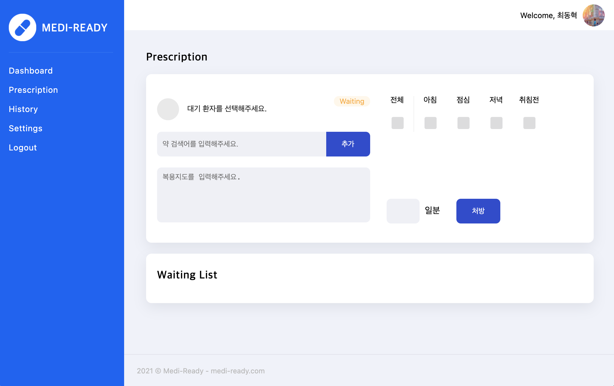

# 💊 MEDI READY 💊

<code>#Medicine</code>
<code>#푸시알림</code>
<code>#복용이력관리</code>
<code>#고객관리</code>

약 먹을 시간을 자동으로 관리해주는 서비스, Medi Ready 입니다!



<br>

약을 언제 먹었는지 기억하지 못해 고민하고 계신가요?  
이제는 Medi Ready를 통해 손쉽게 관리하세요!

복잡한 복약 일정 때문에 고민이라면, 하루도 빠짐없이 제 시간에 약을 챙겨야 한다면, Medi Ready를 이용해주세요.  
Medi Ready는 **자동으로** 알림이 등록되기 때문에 간단하게 이용하실 수 있어요.  
무엇보다 약을 잊고 건너뛰는 일이 없도록 도와드릴게요.

<br>

# 📚 Contents

- [💊 MEDI READY 💊](#-medi-ready-)
- [📚 Contents](#-contents)
- [🔗 Links](#-links)
- [🔍 Preview](#-preview)
- [👨‍⚕️ Motivation](#️-motivation)
- [🎬 Getting Started](#-getting-started)
- [🖥 Tech Stacks](#-tech-stacks)
- [🤯 Challenges](#-challenges)

<br>

# 🔗 Links

### deploy

- [Medi-Ready Web](https://www.mediready.kr)

### Github Repositories

- [Frontend Repo](https://github.com/Medi-Ready/medi-ready-frontend)
- [React-Native Repo](https://github.com/Medi-Ready/medi-ready-rn)
- [Backend Repo](https://github.com/Medi-Ready/medi-ready-backend)
- [Push-Notification-Server Repo](https://github.com/Medi-Ready/medi-ready-push-notification)

<br>

# 🔍 Preview


<br>

# 👨‍⚕️ Motivation

매일 챙겨먹어야 하는 약을 먹었는지 안먹었는지 기억이 나지 않을 때가 종종 있습니다. 그 때마다 약 알림 어플을 찾아보곤 했는데요. 대부분의 어플들은 매번 직접 약을 등록해야 하는 번거로움이 있어 잘 사용하지 않게 되었습니다. 이런 불편함을 개선해보고자 Medi-Ready 프로젝트를 기획해 보았습니다.

<br>

# Features

### 약사용 CRM (웹)

- 환자는 QR 체크인을 통해, 대기명단에 이름을 올릴 수 있습니다.
- 약사는 처방전과 복약 지도를 환자의 어플로 전송합니다.
- 과거 처방 이력을 확인할 수 있습니다.

### 환자용 앱

- 복용 여부를 체크할 수 있습니다.
- 설정한 시간에 푸시 알림을 받습니다.
- 지난 처방 이력을 확인할 수 있으며, 약 정보를 확인할 수 있습니다.

<br>

# 🎬 Getting Started

Local 환경에서 실행시 아래와 같이 준비가 필요합니다.

<details>
  <summary>Client (Web)</summary>

```
REACT_APP_API_KEY=<Firebase API Key>
REACT_APP_AUTH_DOMAIN=<Firebase Auth Domain>
REACT_APP_PROJECT_ID=<Firebase Project ID>
REACT_APP_APP_ID=<Firebase App ID>

REACT_APP_BASE_URL=<default = http://localhost:8080>
```

</details>

<details>
  <summary>Client (Mobile App)</summary>

```
import Constants from "expo-constants";

const ENV = {
  dev: {
    IOS_CLIENT_ID: <Google OAuth IOS client ID>,
    ANDROID_CLIENT_ID: <Google OAuth Android client ID>,
    API_SERVER_URL: <YOUR_IP_ADDRESS_WITH_PROT>,
  },
};

const getEnvVars = (env = Constants.manifest.releaseChannel) => {
  if (__DEV__) {
    return ENV.dev;
  }
};

export default getEnvVars;
```

</details>

<details>
  <summary>Main Server</summary>

```
ORIGIN_URI_DEV=<origin uri: default = "http://localhost:3000">
PUSH_NOTIFICATION_URI=<origin uri: default = http://localhost:8081>

MYSQL_USERNAME=<mysql username: default = root>
MYSQL_PASSWORD=<mysql password>
MYSQL_DATABASE=mediready
MYSQL_HOST=<my sql host: default = "127.0.0.1">

JWT_SECRET_KEY=<jwt secret key>
COOKIE_SECRET_KEY=<cookie secret key>
```

</details>

<details>
<summary>Push Notification Server</summary>

```
EXPO_ACCESS_TOKEN=<Expo Access Token>
```

</details>

<br>

<br>

# 🖥 Tech Stacks

## Client

- React
- React Native (Expo)
- Styled-Component
- Redux Toolkit
- Redux Saga
- React Query

## Server

- Node JS
- Express
- MySQL, Sequelize
- Node Schedule
- Firebase Cloud Messaging(FCM)

## Testing

- Jest
- React Testing Library
- Mocha, Chai

## Deployment

- Netlify
- AWS Elastic Beanstalk

<br>

# 🤯 Challenges

### 협업

### Push Notification

### Search Algorithms
